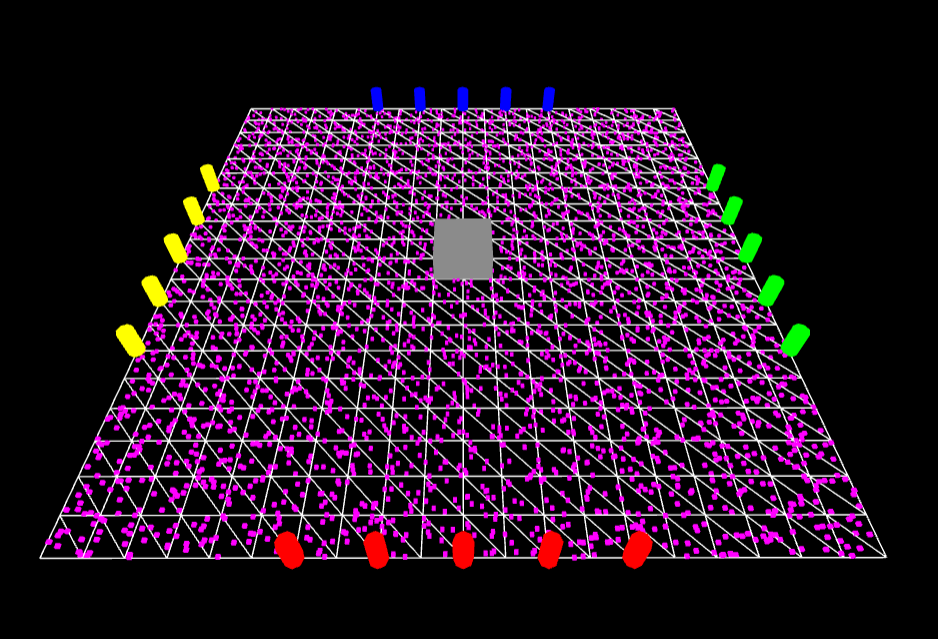
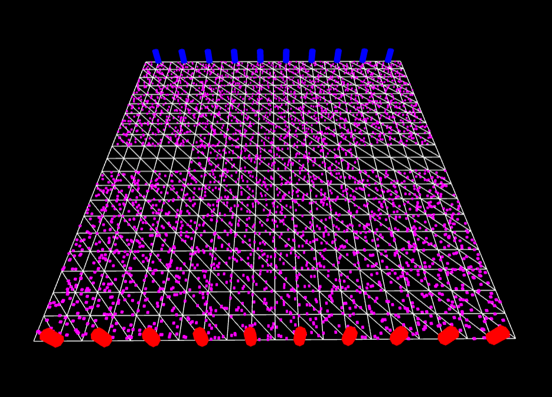
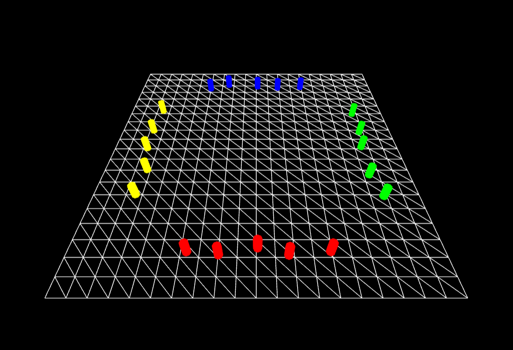
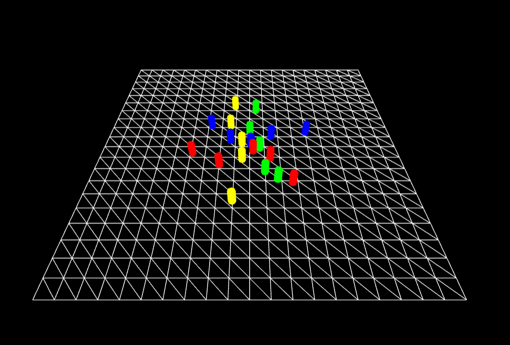
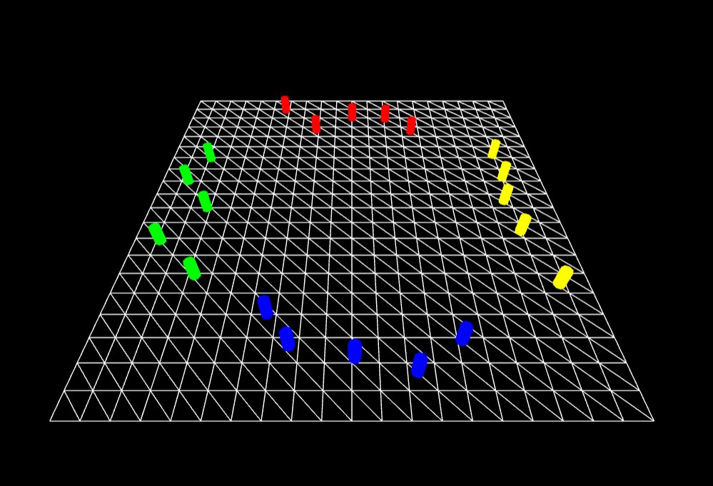
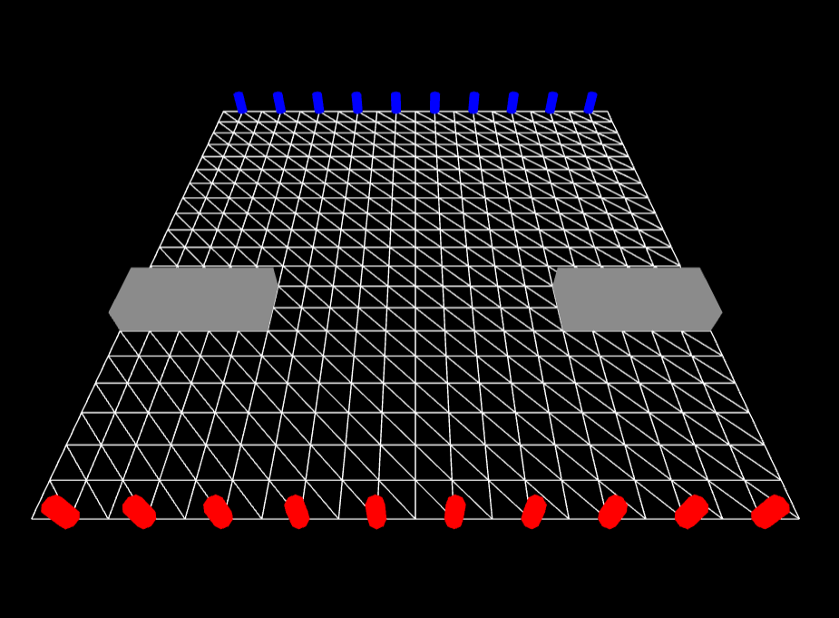
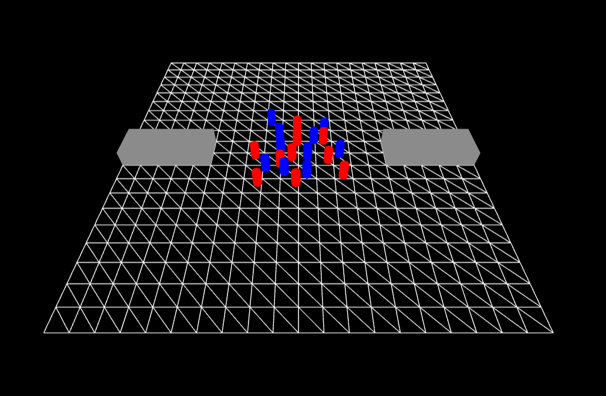
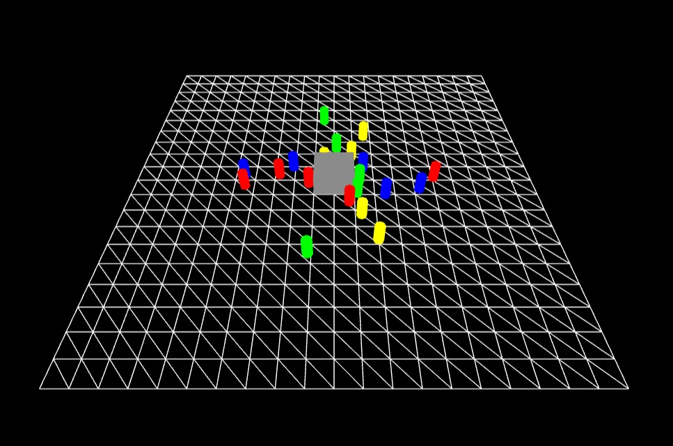
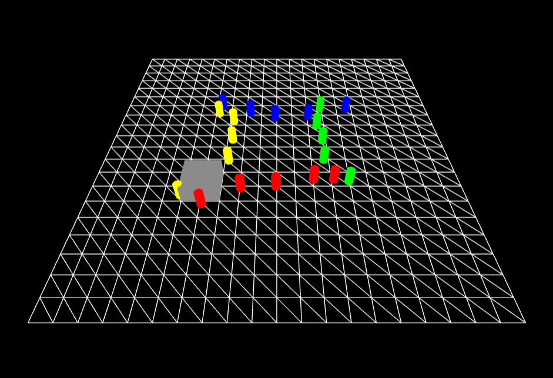
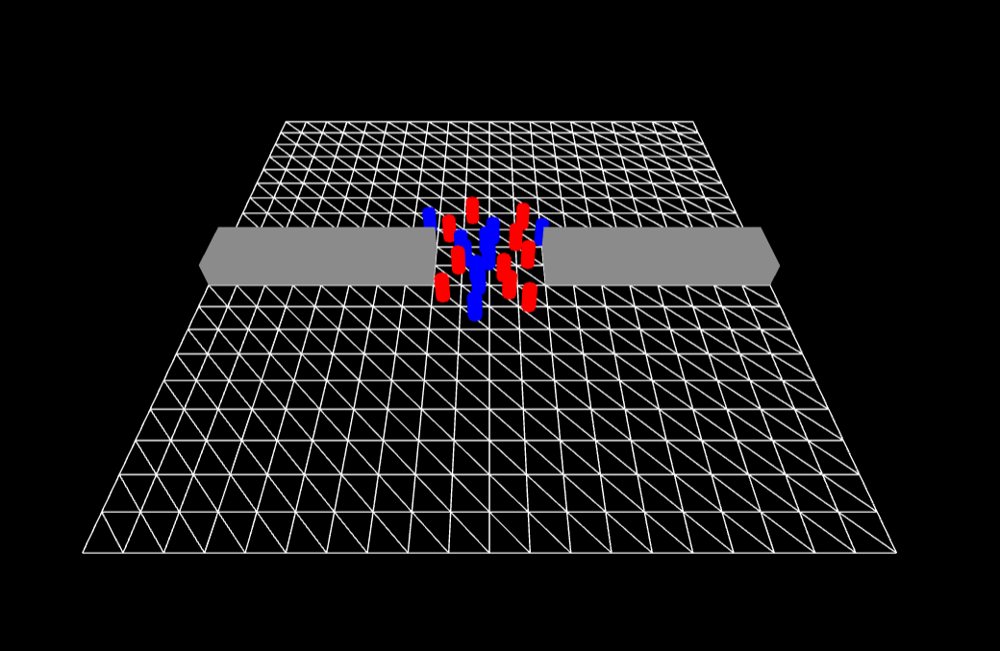

# BioCrowds
Biocrowds is a crowd simulation algorithm based on the formation of veination patterns on leaves. It prevents agents from colliding with each other on their way to their goal points using a notion of "personal space". Personal space is modelled with a space colonization algorithm. Markers (just points) are scattered throughout the simulation space, on the ground. At each simulation frame, each marker becomes "owned" by the agent closest to it (with some max distance representing an agent's perception). Agent velocity at the next frame is then computed using a sum of the displacement vectors to each of its markers. Because a marker can only be owned by one agent at a time, this technique prevents agents from colliding.

## Agent Representation 
My agents hold their current position on the grid, their goal position, thier color, and a list of the markers they own.

## Grid/Marker Representation 
I used stratified sampling to find 10 samples for every cell in my 20 x 20 grid to decide the locations of markers. Here is a picture of my board with all the markers represented by a pink dot:

When I added in obstacles to the simulation, I stopped the agents from entering those obstacles and passing through them by not placing markers at those obstacles positions. Here is a picture of the markers when an obstacle was on the board:

In order to assign markers to the agents I used the following process: I went through each of the markers on my grid and for each of them, I had a variable closestDist, which was set to the radius I wanted to search for markers around the agent, and a variable closestAgent, which was set to undefined. I went through each of the agents, reassigning closestDist and closestAgent if a closer agent than the search radius distance away. If closestAgent was defined, then that agent was given the marker to "own". This process ensured each marker would only be assigned to one unique agent.

## Per Frame 
Every frame I updated which markers each agent owned, calculated those markers' weights based on the cosine of the angle between the vector from the agent to the marker and the vector from the agent to its goal, and combined them to get a vector of displacement for this frame, which I multiplied by the time step (based on speed) and added to the agent's position. In order to keep the agents from colliding with each other, I clamped the final displacement on this frame so that it would not exceed the agent's search radius. 

## Two scenarios
I provided two simulations. In the first one, 5 agents are lined up on each of the top, bottom, left , and right sides of the board. Each of the agents' goals are to get to the exact opposite side of the board. Thus, some difficulty and confusion occurs in the middle of the board. Here are some images of the simulation:

 

In the second simulation, 10 agents are lined up on the top and bottom sides of the board and their goals are again to get to the opposite side. In this simulation, two obstacles with a gao between them provide a simulated doorway, so the agents must wait and form streams to get across. Here are some images of this simulation:

##Interactivity
I provided a speed parameter, which increases the time step, making the agents move more quickly. 

I also provided parameters to add an obstacle on the crossing simulation and move that obstacle on the board, as well as parameters to move the doorway on the board and increase or decrease the gap of the doorway.

Here are images of the crossing simulation with an obstacle:

And an image of the doorway simulation with a smaller gap:

